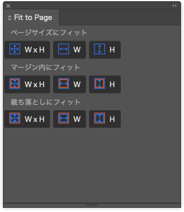

# Fit Frame to Page 

## About

This UXP plugin for InDesign adjusts selected text or image frames to fit the page, margin, or bleed, streamlining workflow and improving productivity.

Users simply select the frame and press the button corresponding to the desired adjustment.

The selected frame can be fitted to the page size or aligned with the margin or bleed area, and users can choose to adjust "both width and height," "width only," or "height only." This eliminates the need for manual resizing and positioning.

- InDesign CC 2023 and later (v18.5.4 and later)

---

## 概要

この UXP plugin for InDesign (UXP プラグイン InDesign用)は、選択したテキストフレームや画像フレームをページ（またはマージン、断ち落としサイズ）に合わせます。

使い方は、フレームを選択し、調整方法に対応したボタンを押すだけです。
選択したフレームは、ページサイズにフィットします。

ページサイズの他に、マージンや断ち落としサイズに合わせることもできます。
サイズを「幅と高さ」「幅のみ」「高さのみ」から選択可能です。

これにより、手動でのサイズ調整や配置の手間を省くことができます。

- InDesign CC 2023 以降 (v18.5.4 以降)

---

# PrivacyPolicy (プライバシーポリシー)

- [PrivacyPolicy Page ⎘](./privacypolicy.md)